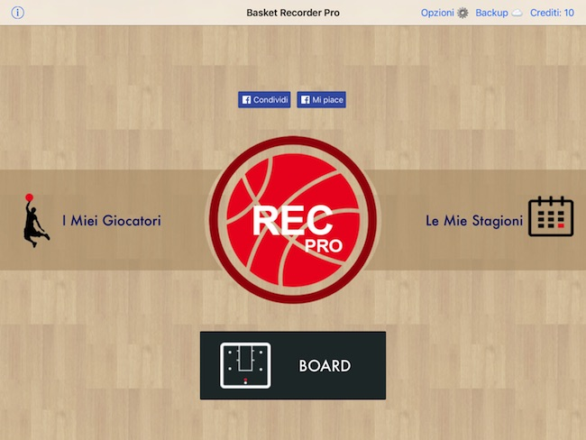
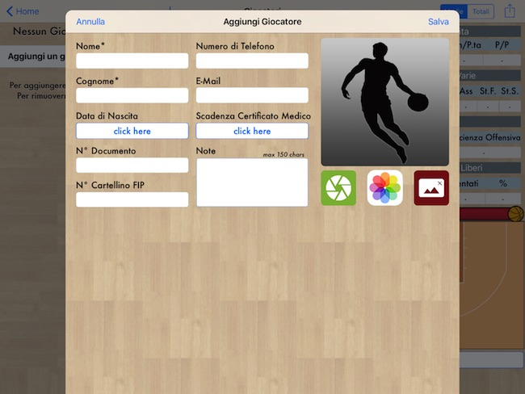
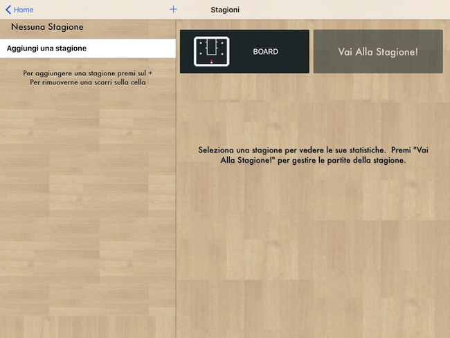
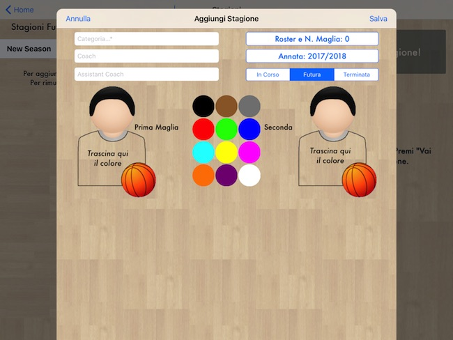
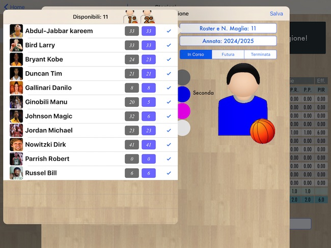
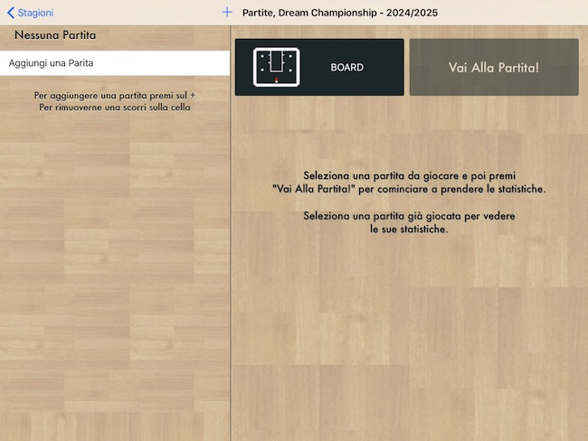
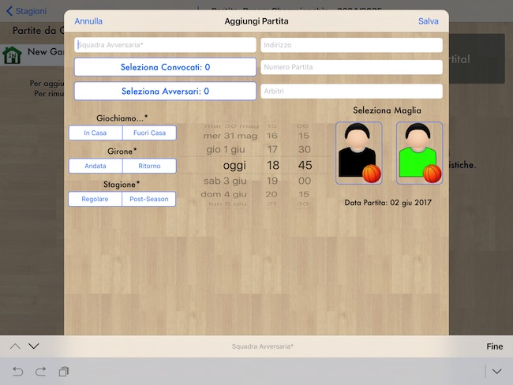
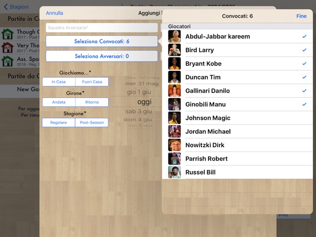
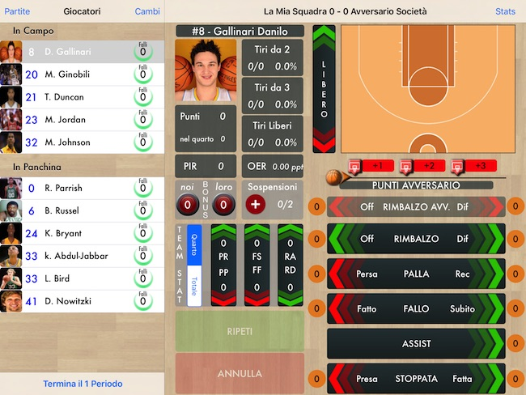

# Basket Recorder Pro

Guida introduttiva per l'App per iPad **[Basket Recorder Pro](https://itunes.apple.com/it/app/basket-recorder-pro/id590251773?mt=8 "Download App"){:target="_blank"}**

Con Basket Recorder Pro puoi finalmente abbandonare i noiosi Scout cartacei, e tenere traccia delle statistiche dei tuoi giocatori direttamente dal tuo iPad.

Puoi memorizzare le statistiche di diverse squadre, in diversi campionati, per poi consultarle nel modo che più ti serve: singolo giocatore, singola partita o intera stagione.

## Indice

- [Per iniziare](#per-iniziare)
- [Come si usa](#come-si-usa)
  - [Giocatori](#giocatori)
  - [Stagioni](#stagioni)
  - [Partite](#partite)
  - [Raccolta Statistiche](#raccolta-statistiche)
- [Domande Frequenti](#domande-frequenti)
  - [Versione Android]()
  - [Numeri Maglia]()
  - [Versione Free]()
  - [Ho aggiunto Giocatore non lo posso convocare]()
- [Contatti](#contatti)


# [](#per-iniziare)Per iniziare

Questa è una guida introduttiva per facilitare l'utilizzo dell'app per iPad **Basket Recorder Pro**

Se hai un iPad ed il tuo sport è il Basket, scarica **Basket Recorder Pro** direttamente dall'**[Apple Store](https://itunes.apple.com/it/app/basket-recorder-pro/id590251773?mt=8 "Download App"){:target="_blank"}**

Puoi anche seguire gli aggiornamenti dell'app o darci dei consigli dalla nostra **[Pagina Facebook](https://www.facebook.com/BasketRecorder "Visita la pagina Facebook"){:target="_blank"}**


# [](#come-si-usa)Come si usa

In questa sezione ti guideremo passo-passo nella configurazione e nell'utilizzo di **[Basket Recorder Pro](https://itunes.apple.com/it/app/basket-recorder-pro/id590251773?mt=8 "Download App"){:target="_blank"}**



La prima schermata permette di navigare verso varie schermate, quali:
- _I Miei Giocatori_
- _Le Mie Stagioni_
- _Board (lavagnetta)_
- _Opzioni / Backup / Crediti_

Cominciamo da quella dei _Giocatori_

## [](#giocatori)Giocatori

Quando si accede per la prima volta alla sezione dei _Giocatori_ ci viene presentata questa schermata:


Da qui, premendo su _Aggiungi un giocatore_ oppure sul _+_ in alto a sinistra, si aprirà la schermata di aggiunta dei giocatori:



Qui vanno creati tutti i giocatori che parteciperanno alla _Stagione_ che creeremo successivamente.

I campi obbligatori sono:
- Nome
- Cognome

## [](#stagioni)Stagioni

Terminata la lista dei _Giocatori_ si può passare, tornando prima alla _Home_, alla schermata delle _Stagioni_



Da qui, premendo su _Aggiungi una stagione_ oppure sul _+_ in alto a sinistra, si aprirà la schermata di aggiunta delle stagioni:



Qui vanno riempito almeno il campo obbligatorio: _Categoria_ e vanno scelti i _Giocatori_ che parteciperanno alla stagione. Questi possono essere anche aggiunti in un secondo momento.

In questa sezione è anche possibile selezionare i numeri della prima e della seconda maglia. Qualora fossero uguali, è sufficiente inserire il numero della prima maglia.



Una volta terminata l'impostazione della stagione, si può passare alla creazione delle partite premendo sul bottone _Vai Alla Stagione!_

## [](#partite)Partite

Arrivati a questo punto vanno inseriti i dati della prima partita della quale si vogliono raccogliere le statistiche.



Da qui, premendo su _Aggiungi una partite_ oppure sul _+_ in alto a sinistra, si aprirà la schermata di aggiunta delle partite:



In questa schermata i campi obbligatori sono:
- Squadra Avversaria
- In Casa / Fuori Casa
- Andata / Ritorno
- Stagione Regolare / Post-Season

Inoltre è possibile selezionare la maglia con la quale si giocherà, ed è obbligatorio selezionare i _Giocatori Convocati_:



Per cominciare una partita bisogna convocare almeno _5 Giocatori_.

## [](#raccolta-statistiche)Raccolta Statistiche

Dopo aver cliccato su _Vai Alla Partita!_ ed aver speso il credito relativo, ci verrà chiesto di inserire il _Quintetto Base_. Per farlo basterà premere sui giocatori che si vogliono schierare in campo; l'app non accetterà più di 5 giocatori schierati.

Una volta terminata questa fase si potrà iniziare a raccogliere le statistiche. Dopo aver selezionato, nella parte sinistra, uno tra i giocatori in campo, ci verrà mostrata la seguente schermata:



Qui ha inizio la fase vera e propria di raccolta delle statistiche.

<iframe style="max-width:100%;" width="650" height="366" src="https://www.youtube.com/embed/1NY_RSH5d28" frameborder="0" allowfullscreen></iframe>


> This is a blockquote following a header.
>
> When something is important enough, you do it even if the odds are not in your favor.

### [](#header-3)Header 3

```js
// Javascript code with syntax highlighting.
var fun = function lang(l) {
  dateformat.i18n = require('./lang/' + l)
  return true;
}
```

```ruby
# Ruby code with syntax highlighting
GitHubPages::Dependencies.gems.each do |gem, version|
  s.add_dependency(gem, "= #{version}")
end
```

#### [](#header-4)Header 4

*   This is an unordered list following a header.
*   This is an unordered list following a header.
*   This is an unordered list following a header.

##### [](#header-5)Header 5

1.  This is an ordered list following a header.
2.  This is an ordered list following a header.
3.  This is an ordered list following a header.

###### [](#header-6)Header 6

| head1        | head two          | three |
|:-------------|:------------------|:------|
| ok           | good swedish fish | nice  |
| out of stock | good and plenty   | nice  |
| ok           | good `oreos`      | hmm   |
| ok           | good `zoute` drop | yumm  |

### There's a horizontal rule below this.

* * *

### Here is an unordered list:

*   Item foo
*   Item bar
*   Item baz
*   Item zip

### And an ordered list:

1.  Item one
1.  Item two
1.  Item three
1.  Item four

### And a nested list:

- level 1 item
  - level 2 item
  - level 2 item
    - level 3 item
    - level 3 item
- level 1 item
  - level 2 item
  - level 2 item
  - level 2 item
- level 1 item
  - level 2 item
  - level 2 item
- level 1 item

### Small image


### Large image


### Definition lists can be used with HTML syntax.

<dl>
<dt>Name</dt>
<dd>Godzilla</dd>
<dt>Born</dt>
<dd>1952</dd>
<dt>Birthplace</dt>
<dd>Japan</dd>
<dt>Color</dt>
<dd>Green</dd>
</dl>

```
Long, single-line code blocks should not wrap. They should horizontally scroll if they are too long. This line should be long enough to demonstrate this.
```

```
The final element.
```
