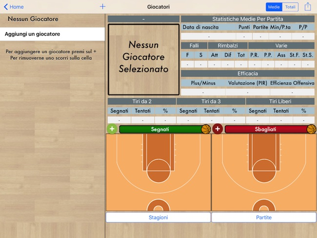

# Basket Recorder Pro

Guida introduttiva per l'App per iPad **[Basket Recorder Pro](https://itunes.apple.com/it/app/basket-recorder-pro/id590251773?mt=8 "Download App"){:target="_blank"}**

Con Basket Recorder Pro puoi finalmente abbandonare i noiosi Scout cartacei, e tenere traccia delle statistiche dei tuoi giocatori direttamente dal tuo iPad.

Puoi memorizzare le statistiche di diverse squadre, in diversi campionati, per poi consultarle nel modo che più ti serve: singolo giocatore, singola partita o intera stagione.

## Indice

- [Per iniziare](#per-iniziare)
- [Come si usa](#come-si-usa)
  - [Giocatori](#giocatori)
  - [Stagioni](#stagioni)
  - [Partite](#partite)
  - [Raccolta Statistiche](#raccolta-statistiche)
  - [Condivisione Statistiche](#condivisione-statistiche)
  - [Modifica Statistiche](#modifica-statistiche)
  - [Backup dei dati](#backup-dei-dati)
- [Domande Frequenti](#domande-frequenti)
  - [Esiste una versione Android?](#esiste-una-versione-android)
  - [Esiste una versione per iPhone?](#esiste-una-versione-per-iphone)
  - [Dove si cambiano i numeri di maglia?](#dove-si-cambiano-i-numeri-di-maglia)
  - [Ho aggiunto un Giocatore, non lo trovo nella lista dei convocabili](#ho-aggiunto-un-giocatore-non-lo-trovo-nella-lista-dei-convocabili)
  - [Posso importare i dati dalla versione Free?](#posso-importare-i-dati-dalla-versione-free)
- [Contatti](#contatti)

# Per iniziare

Questa è una guida introduttiva per facilitare l'utilizzo dell'app per iPad **Basket Recorder Pro**

Se hai un iPad ed il tuo sport è il Basket, scarica **Basket Recorder Pro** direttamente dall'**[Apple Store](https://itunes.apple.com/it/app/basket-recorder-pro/id590251773?mt=8 "Download App"){:target="_blank"}**

Puoi anche seguire gli aggiornamenti dell'app o darci dei consigli dalla nostra **[Pagina Facebook](https://www.facebook.com/BasketRecorder "Visita la pagina Facebook"){:target="_blank"}**

# Come si usa

In questa sezione ti guideremo passo-passo nella configurazione e nell'utilizzo di **[Basket Recorder Pro](https://itunes.apple.com/it/app/basket-recorder-pro/id590251773?mt=8 "Download App"){:target="_blank"}**

La prima schermata permette di navigare verso varie schermate, quali:
- _I Miei Giocatori_
- _Le Mie Stagioni_
- _Board (lavagnetta)_
- _Opzioni / Backup / Crediti_

Cominciamo da quella dei _Giocatori_

## Giocatori

Quando si accede per la prima volta alla sezione dei _Giocatori_ ci viene presentata questa schermata:

Da qui, premendo su _Aggiungi un giocatore_ oppure sul _+_ in alto a sinistra, si aprirà la schermata di aggiunta dei giocatori:

Qui vanno creati tutti i giocatori che parteciperanno alla _Stagione_ che creeremo successivamente.

I campi obbligatori sono:
- Nome
- Cognome

## Stagioni

Terminata la lista dei _Giocatori_ si può passare, tornando prima alla _Home_, alla schermata delle _Stagioni_

Da qui, premendo su _Aggiungi una stagione_ oppure sul _+_ in alto a sinistra, si aprirà la schermata di aggiunta delle stagioni:

Qui vanno riempito almeno il campo obbligatorio: _Categoria_ e vanno scelti i _Giocatori_ che parteciperanno alla stagione. Questi possono essere anche aggiunti in un secondo momento.

In questa sezione è anche possibile selezionare i numeri della prima e della seconda maglia. Qualora fossero uguali, è sufficiente inserire il numero della prima maglia.

Una volta terminata l'impostazione della stagione, si può passare alla creazione delle partite premendo sul bottone _Vai Alla Stagione!_

## Partite

Arrivati a questo punto vanno inseriti i dati della prima partita della quale si vogliono raccogliere le statistiche.

Da qui, premendo su _Aggiungi una partite_ oppure sul _+_ in alto a sinistra, si aprirà la schermata di aggiunta delle partite:

In questa schermata i campi obbligatori sono:
- Squadra Avversaria
- In Casa / Fuori Casa
- Andata / Ritorno
- Stagione Regolare / Post-Season

Inoltre è possibile selezionare la maglia con la quale si giocherà, ed è obbligatorio selezionare i _Giocatori Convocati_:

Per cominciare una partita bisogna convocare almeno _5 Giocatori_.

## Raccolta Statistiche

Dopo aver cliccato su _Vai Alla Partita!_ ed aver speso il credito relativo, ci verrà chiesto di inserire il _Quintetto Base_. Per farlo basterà premere sui giocatori che si vogliono schierare in campo; l'app non accetterà più di 5 giocatori schierati.

Una volta terminata questa fase si potrà iniziare a raccogliere le statistiche. Dopo aver selezionato, nella parte sinistra, uno tra i giocatori in campo, ci verrà mostrata la seguente schermata:

Qui ha inizio la fase vera e propria di raccolta delle statistiche.

<iframe class="youtube" width="650" height="366" src="https://www.youtube.com/embed/1NY_RSH5d28?rel=0" frameborder="0" allowfullscreen></iframe>

### Tiri

É possibile memorizzare ti tiri dei vari giocatori, memorizzando anche la posizione dalla quale vengono effettuati e l'esito del tentativo.

<iframe class="youtube" width="650" height="366" src="https://www.youtube.com/embed/0ROZA00jtjg?rel=0" frameborder="0" allowfullscreen></iframe>

### Annulla / Ripristina

Altra funzione fondamentale di *Basket Recorder Pro* è la possbilità di annullare e ripristinare azioni di gioco inserite per sbaglio.

<iframe class="youtube" width="650" height="366" src="https://www.youtube.com/embed/cx404B40HXE?rel=0" frameborder="0" allowfullscreen></iframe>

## Condivisione Statistiche

Dalla schermata della lista delle partite si può accedere al dettaglio delle statistiche, premendo su _vedi le statistiche dettagliate della partita_. 

Dalla schermata che compare è possibile condividere le statistiche in due modi dalle due icone in alto a sinistra sullo schermo.
- Premendo sull'icona con la _freccia verso l'alto_, si può mandare l'immagine delle statistiche via email o postarla su diversi Social Network
- Premendo sull'icona a forma di _matita_ è possibile soltanto inviare email ma, nel contenuto della mail, verrà allegato un file Excel con il riassunto dettagliato della partita. Questo è possbile anche per quel che riguarda le _Stagioni_

## Modifica Statistiche

É possibile editare la maggior parte delle statistiche anche dopo la fine della partita.

## Backup dei dati

Dalla versione 2.6 è possibile fare un backup nel Cloud dei propri dati e ripristinarli su qualsiasi altro dispositivo.
Presto questo processo sarà spiegato più nel dettaglio in questa guida.

## Esiste una versione Android?

Al momento non esiste una versione android dell'App e, attualmente, non è in programma.

## Esiste una versione per iPhone?

**[Basket Recorder Pro](https://itunes.apple.com/it/app/basket-recorder-pro/id590251773?mt=8 "Download App"){:target="_blank"}** è soltato per iPad, ma a breve (speriamo) sarà disponibile anche per iPhone.

## Dove si cambiano i numeri di maglia?

I numeri di maglia, essendo legati alla stagione, si cambiano nel dettaglio della stagione, quindi bisogna:
- Andare a _Le Mie Stagioni_
- Premere sulla _i_ vicino al nome della stagione interessata
- Nella schermata che si apre, premere su _Roster e N° Maglia_
- Cambiare i numeri nelle caselle a fianco dei nomi dei giocatori

## Ho aggiunto un Giocatore, non lo trovo nella lista dei convocabili

Quando si aggiunge un nuovo giocatore, per averlo nella lista dei possibili convocati, bisogna prima inserirlo nel Roster della stagione:
- Andare a _Le Mie Stagioni_
- Premere sulla _i_ vicino al nome della stagione interessata
- Nella schermata che si apre, premere su _Roster e N° Maglia_
- Premere su un giocatore per far comparire la spunta blu accanto al suo nome
- Tutti i giocatori con la spunta blu saranno disponibili nelle partite di quella stagione

## Posso importare i dati dalla versione Free?

Purtroppo no.

# Contatti

Puoi scriverci una mail per qualsiasi cosa [cliccando qui](mailto:basket.recorder@gmail.com)

Puoi anche seguire gli aggiornamenti dell'app o darci dei consigli dalla nostra **[Pagina Facebook](https://www.facebook.com/BasketRecorder "Visita la pagina Facebook"){:target="_blank"}**

Buon Basket a tutti con **[Basket Recorder Pro](https://itunes.apple.com/it/app/basket-recorder-pro/id590251773?mt=8 "Download App"){:target="_blank"}** 
